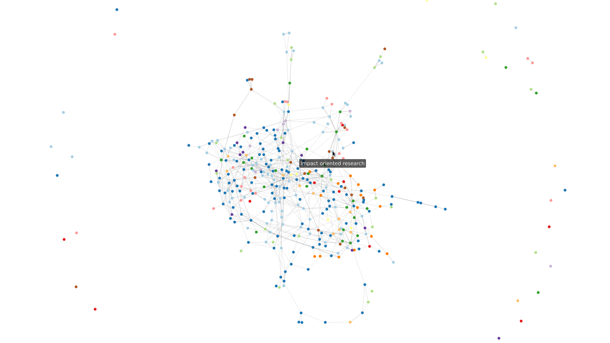

# Zettelkasten-Graph



A simple tool for creating a graph visualization from a markdown-based Zettelkasten.

The graph structure is extracted from the Zettelkasten using Python and visualized in the browser using the javascript
package `force-graph`.

## Installation

Install python dependencies:

```bash
pip install -r requirements.txt
```

Install javascript dependencies:

```bash
npm install
```

## Assumptions

- Zettel are identified via IDs
- each Zettel has its ID in its filename (among other text, if you like) like this `<zettel_ID>_blabla.md`
- Zettel are linked using wikilinks like this `[[<target_ID>]]`
- each Zettel has at least one `H1` heading, the first of which is the Zettel title
- the fist hashtag `#blabla` is the Zettel's category (optional for color)

## Usage

Create an interactive graph visualization from a markdown-based Zettelkasten as follows:

- configure the graph building process in `create_graph.py`
- build the graph `python3 create_graph.py`
- now you should see a file `dist/index.html`
- open this file using your favourite browser to view the graph :)
